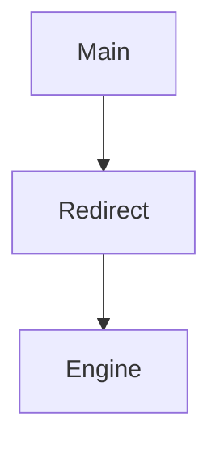

# Operation: Analyze <task-description>

Task-driven deep analysis for development context.

## Precondition

- Task description provided (e.g., "Add dry-run to redirect engine")

## Steps

1. Parse task keywords (e.g., "redirect dry-run" → modules: src/commands/redirect)
2. Read .ai/init-report.md (if absent, execute init)
3. Load previous analysis baseline:
   - .ai/index.json (if exists)
   - `.ai/analysis/latest.md` (if exists)
   - `.ai/insights/*` for likely impacted modules
4. If report outdated (inference: timestamp vs code diffs) → output diff summary, prioritize changed files
5. Trace call chain from entry (e.g., main.rs dispatch)
6. Collect impacted paths (source + tests + configs)
7. Load lang-extensions/xx.md for paths
8. Execute read on each path (incremental first: changed/signature-diff files → unchanged files if needed)
9. Self-check validation metrics
10. Persist report:
   - `.ai/analysis/latest.md`
   - `.ai/analysis/<timestamp>-<task-slug>.md`
   - `.ai/analysis/ai.report.json` + `.ai/analysis/ai.report.md` via:
     - `pwsh -File ".agents/skills/sy-code-insight/scripts/generate-ai-report.ps1" -Task "<task-description>" -UpdateMode "<SKIP|INCREMENTAL|FULL|REINDEX>" -ChangedFiles <n> -DeletedFiles <n> -RenamedFiles <n> -Compile skip -Test skip -Lint skip -Build skip`
   - validate report:
     - `pwsh -File ".agents/skills/sy-code-insight/scripts/validate-ai-report.ps1" -ReportPath ".ai/analysis/ai.report.json" -SchemaPath ".agents/skills/sy-code-insight/references/ai-report.schema.json"`
11. Output report

## Incremental Decision Matrix (MUST)

Before step 8, classify analysis mode by evidence:

| Condition | Mode |
|-----------|------|
| No meaningful delta and cache valid | SKIP |
| Localized changed files/signatures only | INCREMENTAL |
| Entry/interface/build-config changed OR delete/rename involved OR cache missing/stale | FULL |
| Cache/index corruption suspicion or repeated mismatch | REINDEX |

Evidence MUST include:
- git delta (`status/diff --name-status -M`)
- cached insight markers (.ai/insights/*)
- index baseline (.ai/index.json)
- README.AI.md manifest mapping state (if present, prefer `check-manifest-file-state.ps1` output)

## Optimization

Allow step adjustments (e.g., skip Layer 4 if no frontend), MUST declare: "Deviation: Skipped X — Reason: Y"
IF file > 500 lines → signatures only + mark body as Blind Spot

## Output Schema

### Impacted Files

Sorted by modification probability:

| File | Role | Modify Prob (High/Med/Low) | Evidence |
|------|------|----------------------------|----------|
| src/redirect.rs | Core logic | High | file:line |

### Interface/Constraints Summary

| Module | Key Interface | Constraint | Evidence |
|--------|---------------|------------|----------|
| Redirect | fn dry_run() | MUST NOT mutate | file:line |

### Dependency Graph (Mermaid)



### Modification Risks

```
1. [High: Concurrency race in file lock]
2. [Med: Feature gate breakage]
```

### Test Strategy

```
- Unit: Cover new branches
- Integration: End-to-end dry-run
- Manual: Verify no side effects
```

### Incremental Basis (MUST)

```
Update Mode: SKIP | INCREMENTAL | FULL | REINDEX
Delta Basis:
  - changed files: <n>
  - deleted files: <n>
  - renamed files: <n>
  - cache used: <yes/no>
  - README manifest mismatch: <yes/no>
```

### Machine Report (MUST)

```
ai.report.json: .ai/analysis/ai.report.json
ai.report.md: .ai/analysis/ai.report.md
schema: .agents/skills/sy-code-insight/references/ai-report.schema.json
json v3 core fields:
  - schema_name/schema_version/report_name/report_version
  - generated_at/updated_at
  - project(name/root/platform/language_stack)
  - scm(branch/head_commit/base_ref/dirty)
  - run(run_id/phase_id/node_id/started_at/finished_at/duration_ms)
  - files[] (path/name/exists/size_bytes/used_bytes/line_count/encoding/last_modified/fingerprint/previous_fingerprint/change_type/understanding)
  - tree (recursive directory/file children)
```

## Persistence Rules

- MUST create `.ai/analysis/` if absent
- MUST write both `latest.md` and one timestamped historical file
- MUST NOT overwrite historical files
- SHOULD record incremental basis in report (e.g., "Based on git diff + cached insights")
- MUST record decision mode (`SKIP/INCREMENTAL/FULL/REINDEX`) in report
- MUST refresh `.ai/analysis/ai.report.json` and `.ai/analysis/ai.report.md` each analyze run
- MUST validate `.ai/analysis/ai.report.json` after generation; invalid report MUST fail current step
