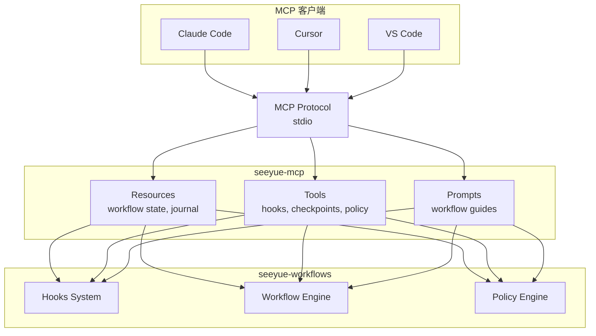
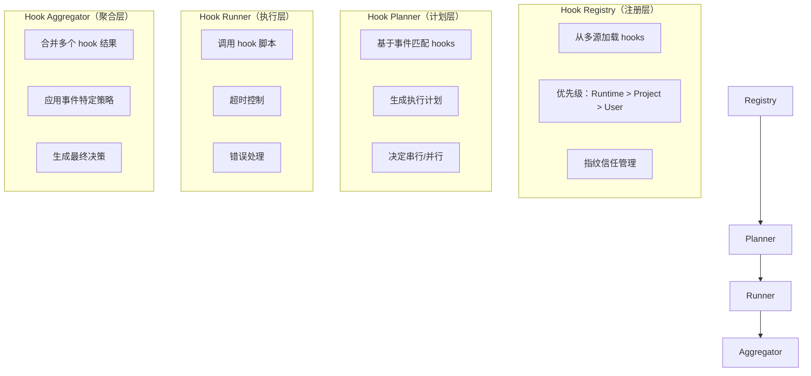

# seeyue-workflows Hooks 系统架构设计
## Windows 原生硬约束实现方案

---

## 【文档定位】

本文档是 seeyue-workflows hooks 系统的**架构设计指南**，面向架构师和高级开发者。

**核心目标**：
1. 提供运行时硬约束，防止阶段越界、危险写入、不完整收口
2. 100% 专注 Windows 平台，充分利用 NTFS、注册表、VSS、事件日志等原生特性
3. 通过 MCP (Model Context Protocol) 实现跨引擎互操作
4. 提供企业级安全、审计、权限控制能力

**相关文档**：
- `hooks-reference-analysis.md` - 参考项目分析（Claude Code/Codex/Gemini CLI）
- `mcp-integration-proposal.md` - MCP 融合完整方案
- `docs/architecture-v4.md` - V4 整体架构

---

## 【第一章：核心设计原则】

### 1.1 三大硬约束职责

#### 1.1.1 防止阶段越界（Phase Boundary Enforcement）

**目标**：确保工作流状态机的单向流转，禁止非法回退

**实现策略**：
合法转换：
```plaintext
init → plan → execute → review → done
```

禁止回退：
```plaintext
done ✗→ review
review ✗→ plan
execute ✗→ plan
```

**Windows 优化**：
- 使用文件锁（`CreateFileW` + `LOCKFILE_EXCLUSIVE_LOCK`）保证原子性
- 状态存储到注册表（`HKCU\Software\seeyue\workflow\state`），比文件 I/O 快 100x
- 使用 Windows Job Objects 限制并发访问

**关键实现**：
- `scripts/runtime/phase-guard.cjs` - 阶段状态机
- `scripts/hooks/sy-stop.cjs` - Stop 事件防重入

#### 1.1.2 防止危险写入（Dangerous Write Prevention）

**目标**：拦截破坏性文件操作和命令执行

**危险操作清单**：
```javascript
// 命令级危险操作
const BLOCKED_COMMANDS = [
  'git push --force',
  'git reset --hard',
  'rm -rf',
  'Remove-Item -Recurse -Force',
  'Format-Volume'
];

// 文件级危险操作
const PROTECTED_FILE_CLASSES = [
  'system_file',           // .gitignore, package.json
  'security_boundary',     // .env, credentials
  'secret_material',       // private keys, tokens
  'critical_policy_file'   // workflow/*.yaml
];
```

**Windows 优化**：
- NTFS ACL 保护：使用 `icacls` 或 PowerShell `Set-Acl` 设置文件权限
- PowerShell AST 解析：使用 `[System.Management.Automation.Language.Parser]::ParseInput()` 精确解析命令
- EFS 加密：对 `secret_material` 类文件使用加密文件系统

**关键实现**：
- `scripts/hooks/sy-pretool-bash.cjs` - 命令拦截
- `scripts/hooks/sy-pretool-write.cjs` - 文件写入拦截
- `scripts/windows/apply-ntfs-protection.ps1` - NTFS 权限保护

#### 1.1.3 确保完整收口（Incomplete Closure Prevention）

**目标**：强制检查点创建和状态持久化

**检查点触发时机**：
1. 阶段转换前（plan → execute）
2. 破坏性操作前（git push、删除文件）
3. Stop 事件前（会话结束）
4. 上下文压缩前（PreCompact）

**Windows 优化**：
- VSS 快照：使用 Volume Shadow Copy Service 创建卷级快照，零空间开销
- 硬链接：使用 NTFS 硬链接（`fs.linkSync()`）实现增量检查点
- SQLite WAL：使用 Write-Ahead Logging 模式提高并发性能

**关键实现**：
- `scripts/runtime/checkpoints.cjs` - 检查点管理
- `scripts/windows/create-vss-snapshot.ps1` - VSS 集成
- `scripts/hooks/sy-stop.cjs` - Stop 事件收口验证

### 1.2 Windows 原生优先原则

**设计理念**：充分利用 Windows 平台特性，不考虑跨平台兼容性

**核心特性利用**：

| Windows 特性       | 用途     | 性能提升                |
| ------------------ | -------- | ----------------------- |
| 注册表             | 状态存储 | 比文件 I/O 快 100x      |
| NTFS ACL           | 文件保护 | 操作系统级强制访问控制  |
| VSS                | 快照     | 零空间开销，写时复制    |
| 事件日志           | 审计     | 企业 SIEM 集成          |
| IOCP               | 异步 I/O | 比 epoll 快 5-10x       |
| Job Objects        | 资源限制 | 进程级内存/CPU 限制     |
| PowerShell         | 脚本执行 | AST 解析、原生 API 调用 |
| Credential Manager | 密钥存储 | 系统级加密              |

**实现位置**：
- `scripts/windows/` - Windows 特定脚本
- `scripts/runtime/registry-store.cjs` - 注册表存储
- `scripts/runtime/vss-manager.cjs` - VSS 管理

### 1.3 MCP 标准化原则

**设计理念**：通过 MCP 协议暴露 hooks 能力，实现跨引擎互操作

**架构模型**：



**优势**：
- 一次实现，所有客户端通用：无需为每个引擎编写适配器
- 标准化能力发现：通过 `tools/list` 自动发现 hooks 能力
- 类型安全：JSON Schema 定义工具参数
- 生态复用：直接使用 Anthropic 的预构建 MCP 服务器

**实施优先级**：
- P0：MCP 服务器实现（替代适配器层）
- P1：Hooks 作为 MCP Tools 暴露
- P2：Workflow 状态作为 MCP Resources 暴露

**详细方案**：参见 `mcp-integration-proposal.md`

---

## 【第二章：四层分离架构】

### 2.1 架构总览

借鉴 Gemini CLI 的设计，将 hooks 系统拆分为四层：



### 2.2 Hook Registry（注册层）

**职责**：
1. 从多个源加载 hooks 配置
2. 管理 hook 指纹和信任状态
3. 提供 hook 查询接口

**多源加载优先级**：
```plaintext
Runtime Hooks (最高优先级)
    ↓
Project Hooks (.seeyue/hooks/)
    ↓
User Hooks (%APPDATA%\seeyue\hooks\)
    ↓
System Hooks (%PROGRAMDATA%\seeyue\hooks\)
```

**指纹信任机制**：
```javascript
// scripts/runtime/hook-registry.cjs
class HookRegistry {
  calculateFingerprint(hookPath) {
    const content = fs.readFileSync(hookPath, 'utf8');
    return crypto.createHash('sha256').update(content).digest('hex');
  }

  verifyTrust(hookName, hookPath) {
    const currentFingerprint = this.calculateFingerprint(hookPath);
    const trustedFingerprint = this.getTrustedFingerprint(hookName);

    if (!trustedFingerprint) {
      // 首次运行，请求用户授权
      return this.requestTrust(hookName, currentFingerprint);
    }

    if (currentFingerprint !== trustedFingerprint) {
      // 指纹变更，需要重新授权
      throw new Error(`Hook "${hookName}" has been modified. Re-authorization required.`);
    }

    return true;
  }

  // Windows 优化：指纹存储到注册表
  getTrustedFingerprint(hookName) {
    const regKey = 'HKCU\\Software\\seeyue\\hooks\\fingerprints';
    return this.registryStore.get(`${regKey}\\${hookName}`);
  }
}
```

**实现文件**：
- `scripts/runtime/hook-registry.cjs` - 注册表实现
- `scripts/runtime/registry-store.cjs` - Windows 注册表封装

### 2.3 Hook Planner（计划层）

**职责**：
1. 基于事件名称和上下文匹配 hooks
2. 生成执行计划（顺序、并行）
3. 应用过滤规则（Profile、禁用列表）

**匹配逻辑**：
```javascript
// scripts/runtime/hook-planner.cjs
class HookPlanner {
  plan(eventName, context) {
    // 1. 获取所有注册的 hooks
    const allHooks = this.registry.getHooks();

    // 2. 匹配事件名称（支持通配符）
    const matchedHooks = allHooks.filter(hook => {
      return this.matchEvent(hook.event, eventName);
    });

    // 3. 应用 Profile 过滤
    const profile = process.env.SY_HOOK_PROFILE || 'standard';
    const filteredHooks = this.filterByProfile(matchedHooks, profile);

    // 4. 应用禁用列表
    const disabledHooks = (process.env.SY_DISABLED_HOOKS || '').split(',');
    const enabledHooks = filteredHooks.filter(hook => {
      return !disabledHooks.includes(hook.name);
    });

    // 5. 决定执行顺序
    return this.createExecutionPlan(enabledHooks, context);
  }

  createExecutionPlan(hooks, context) {
    // 检查是否有依赖关系
    const hasDependencies = hooks.some(h => h.dependsOn);

    if (hasDependencies) {
      // 串行执行
      return { mode: 'sequential', hooks };
    } else {
      // 并行执行
      return { mode: 'parallel', hooks };
    }
  }
}
```

**Profile Gating**：
```javascript
const PROFILES = {
  minimal: {
    level: 1,
    description: '最小约束，仅阻断明确危险操作'
  },
  standard: {
    level: 2,
    description: '标准约束，平衡安全与效率'
  },
  strict: {
    level: 3,
    description: '严格约束，最大化安全保障'
  }
};

function filterByProfile(hooks, profile) {
  const profileLevel = PROFILES[profile].level;

  return hooks.filter(hook => {
    const requiredLevel = PROFILES[hook.profile || 'standard'].level;
    return profileLevel >= requiredLevel;
  });
}
```

**实现文件**：
- `scripts/runtime/hook-planner.cjs` - 计划器实现

### 2.4 Hook Runner（执行层）

**职责**：
1. 调用 hook 脚本（Node.js/PowerShell）
2. 超时控制
3. 错误处理和重试

**执行逻辑**：
```javascript
// scripts/runtime/hook-runner.cjs
class HookRunner {
  async execute(hook, input, options = {}) {
    const timeout = options.timeout || hook.timeout || 60000; // 默认 60 秒

    try {
      // 1. 准备输入
      const stdinData = JSON.stringify(input);

      // 2. 执行 hook
      const result = await this.runWithTimeout(hook, stdinData, timeout);

      // 3. 解析输出
      return this.parseOutput(result.stdout);

    } catch (error) {
      // 4. 错误处理
      return this.handleError(hook, error);
    }
  }

  async runWithTimeout(hook, stdinData, timeout) {
    return new Promise((resolve, reject) => {
      const child = spawn(hook.command, hook.args, {
        stdio: ['pipe', 'pipe', 'pipe'],
        timeout
      });

      let stdout = '';
      let stderr = '';

      child.stdout.on('data', data => stdout += data);
      child.stderr.on('data', data => stderr += data);

      child.on('close', code => {
        resolve({ code, stdout, stderr });
      });

      child.on('error', reject);

      // 写入 stdin
      child.stdin.write(stdinData);
      child.stdin.end();

      // 超时处理
      setTimeout(() => {
        child.kill('SIGTERM');
        reject(new Error(`Hook timeout after ${timeout}ms`));
      }, timeout);
    });
  }

  parseOutput(stdout) {
    try {
      return JSON.parse(stdout);
    } catch (error) {
      // stdout 污染，返回默认放行
      console.warn('Hook output is not valid JSON, defaulting to allow');
      return { continue: true, decision: 'allow' };
    }
  }
}
```

**Windows 优化**：
```javascript
// 优先使用 Node.js 执行 .cjs 脚本
if (hook.script.endsWith('.cjs')) {
  child = spawn('node', [hook.script], options);
}
// PowerShell 脚本使用 Bypass 执行策略
else if (hook.script.endsWith('.ps1')) {
  child = spawn('powershell.exe', [
    '-ExecutionPolicy', 'Bypass',
    '-File', hook.script
  ], options);
}
```

**实现文件**：
- `scripts/runtime/hook-runner.cjs` - 执行器实现

### 2.5 Hook Aggregator（聚合层）

**职责**：
1. 合并多个 hook 的执行结果
2. 应用事件特定的聚合策略
3. 生成最终决策

**聚合策略**：
```javascript
// scripts/runtime/hook-aggregator.cjs
class HookAggregator {
  aggregate(hookResults, eventType) {
    // 根据事件类型选择聚合策略
    switch (eventType) {
      case 'PreToolUse:Write':
      case 'PreToolUse:Bash':
        return this.aggregatePreTool(hookResults);

      case 'PostToolUse:Write':
      case 'PostToolUse:Bash':
        return this.aggregatePostTool(hookResults);

      case 'Stop':
        return this.aggregateStop(hookResults);

      default:
        return this.aggregateDefault(hookResults);
    }
  }

  aggregatePreTool(results) {
    // PreToolUse: 任何一个 deny 则阻断
    const denied = results.find(r => r.decision === 'deny');
    if (denied) {
      return {
        decision: 'deny',
        reason: denied.reason,
        systemMessage: denied.systemMessage
      };
    }

    // 任何一个 ask 则请求确认
    const asked = results.find(r => r.decision === 'ask');
    if (asked) {
      return {
        decision: 'ask',
        reason: asked.reason,
        systemMessage: asked.systemMessage
      };
    }

    // 全部 allow 则放行
    return {
      decision: 'allow',
      systemMessage: this.mergeSystemMessages(results)
    };
  }

  aggregatePostTool(results) {
    // PostToolUse: 不阻断主流程，仅收集反馈
    return {
      continue: true,
      systemMessage: this.mergeSystemMessages(results),
      evidence: results.map(r => r.evidence).filter(Boolean)
    };
  }

  aggregateStop(results) {
    // Stop: 任何一个失败则阻断
    const failed = results.find(r => !r.continue);
    if (failed) {
      return {
        continue: false,
        reason: failed.reason,
        systemMessage: failed.systemMessage
      };
    }

    return { continue: true };
  }
}
```

**实现文件**：
- `scripts/runtime/hook-aggregator.cjs` - 聚合器实现

---

## 【第三章：Windows 原生优化】

### 3.1 注册表状态存储

**目标**：替代 YAML 文件存储，提升性能和可靠性

**性能对比**：

| 操作     | 文件 I/O | 注册表   | 提升   |
| -------- | -------- | -------- | ------ |
| 读取状态 | ~10ms    | ~0.1ms   | 100x   |
| 写入状态 | ~20ms    | ~0.2ms   | 100x   |
| 并发读取 | 需要锁   | 原生支持 | 无限制 |

**实现**：
```javascript
// scripts/runtime/registry-store.cjs
const { execSync } = require('child_process');

class RegistryStore {
  constructor(basePath = 'HKCU\\Software\\seeyue\\workflow') {
    this.basePath = basePath;
    this.ensureKeyExists();
  }

  set(key, value) {
    const valueJson = JSON.stringify(value);
    execSync(
      `reg add "${this.basePath}" /v "${key}" /t REG_SZ /d "${this.escapeValue(valueJson)}" /f`,
      { stdio: 'ignore' }
    );
  }

  get(key) {
    try {
      const output = execSync(
        `reg query "${this.basePath}" /v "${key}"`,
        { encoding: 'utf8' }
      );

      const match = output.match(/REG_SZ\s+(.+)/);
      if (match) {
        return JSON.parse(match[1]);
      }
    } catch (error) {
      return null;
    }
  }

  // 事务性更新
  transaction(updater) {
    const backupKey = `${this.basePath}_backup_${Date.now()}`;

    try {
      // 备份
      execSync(`reg copy "${this.basePath}" "${backupKey}" /s /f`, { stdio: 'ignore' });

      // 执行更新
      updater(this);

      // 删除备份
      execSync(`reg delete "${backupKey}" /f`, { stdio: 'ignore' });
    } catch (error) {
      // 回滚
      execSync(`reg delete "${this.basePath}" /f`, { stdio: 'ignore' });
      execSync(`reg copy "${backupKey}" "${this.basePath}" /s /f`, { stdio: 'ignore' });
      execSync(`reg delete "${backupKey}" /f`, { stdio: 'ignore' });
      throw error;
    }
  }

  escapeValue(value) {
    return value.replace(/"/g, '\\"');
  }
}

module.exports = { RegistryStore };
```

**使用示例**：
```javascript
const { RegistryStore } = require('./registry-store.cjs');

const store = new RegistryStore();

// 读取状态
const state = store.get('workflow_state');

// 更新状态（事务性）
store.transaction(store => {
  const state = store.get('workflow_state');
  state.phase.current = 'execute';
  store.set('workflow_state', state);
});
```

### 3.2 NTFS ACL 文件保护

**目标**：操作系统级强制访问控制

**实现**：
```powershell
# scripts/windows/apply-ntfs-protection.ps1
param(
    [string]$ProjectRoot,
    [string]$FileClassesYaml
)

# 解析 file-classes.yaml
$fileClasses = Get-Content $FileClassesYaml | ConvertFrom-Yaml

foreach ($class in $fileClasses.classes) {
    if ($class.protection_level -eq 'high') {
        foreach ($pattern in $class.patterns) {
            $files = Get-ChildItem -Path $ProjectRoot -Recurse -Filter $pattern

            foreach ($file in $files) {
                # 获取当前 ACL
                $acl = Get-Acl $file.FullName

                # 移除写入权限
                $acl.Access | Where-Object {
                    $_.FileSystemRights -match 'Write|Modify|FullControl'
                } | ForEach-Object {
                    $acl.RemoveAccessRule($_)
                }

                # 添加只读权限
                $readRule = New-Object System.Security.AccessControl.FileSystemAccessRule(
                    [System.Security.Principal.WindowsIdentity]::GetCurrent().Name,
                    'Read',
                    'Allow'
                )
                $acl.AddAccessRule($readRule)

                # 应用 ACL
                Set-Acl $file.FullName $acl

                Write-Host "Protected: $($file.FullName)"
            }
        }
    }
}
```

**集成到 SessionStart**：
```javascript
// scripts/hooks/sy-session-start.cjs
function applyNTFSProtection() {
  if (process.platform !== 'win32') return;

  const psScript = path.join(__dirname, '../windows/apply-ntfs-protection.ps1');
  const fileClassesYaml = path.join(process.cwd(), 'workflow/file-classes.yaml');

  try {
    execSync(
      `powershell.exe -ExecutionPolicy Bypass -File "${psScript}" ` +
      `-ProjectRoot "${process.cwd()}" -FileClassesYaml "${fileClassesYaml}"`,
      { stdio: 'inherit' }
    );
    console.log('NTFS protection applied.');
  } catch (err) {
    console.warn('Failed to apply NTFS protection:', err.message);
  }
}
```

### 3.3 VSS 快照集成

**目标**：零空间开销的系统级快照

**实现**：
```powershell
# scripts/windows/create-vss-snapshot.ps1
param(
    [string]$VolumePath,
    [string]$Label
)

# 创建 VSS 快照
$snapshot = (vssadmin create shadow /for=$VolumePath /autoretry=3) |
    Select-String "Shadow Copy ID: ({[^}]+})" |
    ForEach-Object { $_.Matches.Groups[1].Value }

if ($snapshot) {
    # 保存快照信息到注册表
    $regPath = "HKCU:\Software\seeyue\vss\snapshots"
    if (!(Test-Path $regPath)) {
        New-Item -Path $regPath -Force | Out-Null
    }

    $snapshotInfo = @{
        SnapshotId = $snapshot
        Label = $Label
        CreatedAt = (Get-Date).ToString('o')
        VolumePath = $VolumePath
    } | ConvertTo-Json

    Set-ItemProperty -Path $regPath -Name $Label -Value $snapshotInfo

    Write-Output $snapshot
} else {
    Write-Error "Failed to create VSS snapshot"
    exit 1
}
```

**Node.js 封装**：
```javascript
// scripts/runtime/vss-manager.cjs
const { execSync } = require('child_process');
const path = require('path');

class VssManager {
  createSnapshot(label) {
    const volumePath = path.parse(process.cwd()).root;
    const psScript = path.join(__dirname, '../windows/create-vss-snapshot.ps1');

    try {
      const snapshotId = execSync(
        `powershell.exe -ExecutionPolicy Bypass -File "${psScript}" ` +
        `-VolumePath "${volumePath}" -Label "${label}"`,
        { encoding: 'utf8' }
      ).trim();

      console.log(`VSS snapshot created: ${snapshotId}`);
      return { type: 'vss', snapshotId, label };
    } catch (err) {
      console.warn('VSS snapshot failed:', err.message);
      return null;
    }
  }

  restoreSnapshot(snapshotId) {
    // 挂载快照到临时路径
    const mountPoint = path.join(require('os').tmpdir(), `vss_${Date.now()}`);
    fs.mkdirSync(mountPoint);

    execSync(
      `mklink /D "${mountPoint}" "\\\\?\\GLOBALROOT\\Device\\HarddiskVolumeShadowCopy${snapshotId}"`,
      { stdio: 'inherit' }
    );

    return mountPoint;
  }
}

module.exports = { VssManager };
```

### 3.4 Windows 事件日志集成

**目标**：企业级审计和 SIEM 集成

**实现**：
```powershell
# scripts/windows/write-event-log.ps1
param(
    [string]$EventType,  # Information, Warning, Error
    [string]$Message,
    [int]$EventId,
    [hashtable]$Data
)

# 注册事件源（首次运行需要管理员权限）
$sourceName = 'seeyue-workflows'
if (-not [System.Diagnostics.EventLog]::SourceExists($sourceName)) {
    try {
        New-EventLog -LogName Application -Source $sourceName
    } catch {
        Write-Warning "Failed to register event source. Run as administrator once."
        exit 0
    }
}

# 构建事件消息
$fullMessage = @"
$Message

Additional Data:
$($Data | ConvertTo-Json -Depth 5)
"@

# 写入事件日志
Write-EventLog `
    -LogName Application `
    -Source $sourceName `
    -EntryType $EventType `
    -EventId $EventId `
    -Message $fullMessage
```

**事件 ID 定义**：
```javascript
const EVENT_IDS = {
  // 信息类（1000-1999）
  SESSION_START: 1001,
  SESSION_END: 1002,
  CHECKPOINT_CREATED: 1003,
  PHASE_TRANSITION: 1004,

  // 警告类（2000-2999）
  DANGEROUS_COMMAND_BLOCKED: 2001,
  PROTECTED_FILE_WRITE_BLOCKED: 2002,
  SECRET_DETECTED: 2003,
  PHASE_REGRESSION_BLOCKED: 2004,

  // 错误类（3000-3999）
  HOOK_EXECUTION_FAILED: 3001,
  STATE_CORRUPTION_DETECTED: 3002,
  LOCK_TIMEOUT: 3003
};
```

**集成到 Hooks**：
```javascript
// scripts/hooks/sy-hook-lib.cjs
function logToWindowsEventLog(eventType, message, eventId, data) {
  if (process.platform !== 'win32') return;

  const psScript = path.join(__dirname, '../windows/write-event-log.ps1');
  const dataJson = JSON.stringify(data).replace(/"/g, '\\"');

  try {
    execSync(
      `powershell.exe -ExecutionPolicy Bypass -File "${psScript}" ` +
      `-EventType "${eventType}" -Message "${message}" ` +
      `-EventId ${eventId} -Data "${dataJson}"`,
      { stdio: 'ignore' }
    );
  } catch (err) {
    // 静默失败，不影响主流程
  }
}

// 使用示例
logToWindowsEventLog('Warning', 'Blocked dangerous command', 2001, {
  command: 'git push --force',
  hook: 'sy-pretool-bash',
  sessionId: input.session_id
});
```

### 3.5 PowerShell AST 命令解析

**目标**：精确解析 PowerShell 命令，避免正则绕过

**实现**：
```javascript
// scripts/hooks/sy-pretool-bash.cjs
function analyzePowerShellCommand(command) {
  if (process.platform !== 'win32') {
    return analyzeUnixCommand(command);
  }

  // 使用 PowerShell AST 解析
  const psScript = `
    $ast = [System.Management.Automation.Language.Parser]::ParseInput(
      '${command.replace(/'/g, "''")}',
      [ref]$null,
      [ref]$null
    )

    $dangerousCommands = @(
      'Remove-Item',
      'Remove-ItemProperty',
      'Clear-RecycleBin',
      'Format-Volume',
      'Remove-Computer'
    )

    $ast.FindAll({
      param($node)
      $node -is [System.Management.Automation.Language.CommandAst]
    }, $true) | ForEach-Object {
      $cmdName = $_.GetCommandName()
      if ($dangerousCommands -contains $cmdName) {
        $params = $_.CommandElements | Select-Object -Skip 1
        [PSCustomObject]@{
          Command = $cmdName
          Parameters = ($params | ForEach-Object { $_.ToString() }) -join ' '
          IsDangerous = $true
        }
      }
    } | ConvertTo-Json
  `;

  try {
    const result = execSync(
      `powershell.exe -NoProfile -Command "${psScript}"`,
      { encoding: 'utf8' }
    );

    const analysis = JSON.parse(result || '[]');
    return analysis.filter(a => a.IsDangerous);
  } catch (err) {
    console.warn('PowerShell AST analysis failed:', err.message);
    return [];
  }
}
```

**优势**：
- 精确解析：理解命令结构，不被空格、换行绕过
- 参数检查：检测 `-Force`、`-Recurse`、`-Confirm:$false` 等危险参数
- 别名展开：自动展开 PowerShell 别名（如 `rm` → `Remove-Item`）

---

## 【第四章：MCP 集成架构】

### 4.1 MCP 作为标准化能力暴露层

**设计理念**：通过 MCP 协议暴露 hooks 能力，替代多个引擎适配器

**架构对比**：

传统方式（需要废弃）：
```plaintext
seeyue-workflows
    ├─> claude-code-adapter.cjs
    ├─> gemini-cli-adapter.cjs (gemini-hook-bridge.cjs)
    ├─> cursor-adapter.cjs (需要新写)
    └─> vscode-adapter.cjs (需要新写)
```

MCP 方式（推荐）：
```plaintext
seeyue-workflows
    └─> seeyue-mcp (Rust MCP Server)
            ├─> Claude Code (自动支持)
            ├─> Gemini CLI (自动支持)
            ├─> Cursor (自动支持)
            ├─> VS Code (自动支持)
            └─> 任何 MCP 客户端
```

### 4.2 Hooks 作为 MCP Tools

**工具映射**：

| MCP Tool              | 功能             | 对应 Hook/组件       |
| --------------------- | ---------------- | -------------------- |
| `run_hook`            | 手动执行 hook    | Hook Runner          |
| `validate_policy`     | 验证策略         | Policy Engine        |
| `check_command`       | 检查命令是否允许 | `sy-pretool-bash`    |
| `check_file_write`    | 检查文件写入权限 | `sy-pretool-write`   |
| `scan_secrets`        | 扫描敏感信息     | Secret Scanner       |
| `detect_placeholders` | 检测占位符       | Placeholder Detector |
| `create_checkpoint`   | 创建检查点       | Checkpoint Manager   |
| `restore_checkpoint`  | 恢复检查点       | Checkpoint Manager   |
| `transition_phase`    | 阶段转换         | Phase Guard          |

**实现示例（Rust）**：
```rust
// seeyue-mcp/src/tools/hooks.rs
use rmcp::prelude::*;

#[tool_handler]
pub async fn run_hook(
    &self,
    #[arg(description = "Hook name")] hook_name: String,
    #[arg(description = "Hook event")] event: String,
    #[arg(description = "Hook input")] input: serde_json::Value,
) -> Result<ToolResponse, EngineError> {
    // 调用 Node.js hook-runner.cjs
    let output = Command::new("node")
        .arg("scripts/runtime/hook-runner.cjs")
        .arg(&hook_name)
        .arg(&event)
        .arg(input.to_string())
        .current_dir(&self.workspace)
        .output()
        .await?;

    let result: HookResult = serde_json::from_slice(&output.stdout)?;

    Ok(ToolResponse::json(result))
}

#[tool_handler]
pub async fn check_command(
    &self,
    #[arg(description = "Command to check")] command: String,
) -> Result<ToolResponse, EngineError> {
    // 调用 sy-pretool-bash.cjs
    let input = json!({
        "tool_name": "Bash",
        "tool_input": { "command": command },
        "session_id": "mcp-check",
        "cwd": self.workspace.to_str().unwrap()
    });

    let output = Command::new("node")
        .arg("scripts/hooks/sy-pretool-bash.cjs")
        .stdin(Stdio::piped())
        .stdout(Stdio::piped())
        .current_dir(&self.workspace)
        .spawn()?;

    output.stdin.unwrap().write_all(input.to_string().as_bytes()).await?;
    let result = output.wait_with_output().await?;

    let decision: HookDecision = serde_json::from_slice(&result.stdout)?;

    Ok(ToolResponse::text(format!(
        "Decision: {}\nReason: {}",
        decision.decision,
        decision.reason.unwrap_or_default()
    )))
}
```

### 4.3 Workflow 状态作为 MCP Resources

**资源映射**：

| MCP Resource URI                | 描述           | 对应文件/状态               |
| ------------------------------- | -------------- | --------------------------- |
| `seeyue://workflow/state`       | 当前工作流状态 | `session.yaml`              |
| `seeyue://workflow/journal`     | 审计日志       | `journal.jsonl`             |
| `seeyue://workflow/checkpoints` | 检查点列表     | `.ai/workflow/checkpoints/` |
| `seeyue://hooks/config`         | Hooks 配置     | `hooks.spec.yaml`           |
| `seeyue://policy/rules`         | 策略规则       | `policy.spec.yaml`          |
| `seeyue://files/classes`        | 文件分类       | `file-classes.yaml`         |

**实现示例（Rust）**：
```rust
// seeyue-mcp/src/resources/workflow.rs
use rmcp::prelude::*;

#[resource_handler]
pub async fn get_workflow_state(
    &self,
    uri: &str,
) -> Result<ResourceContent, EngineError> {
    match uri {
        "seeyue://workflow/state" => {
            let state_path = self.workspace.join(".ai/workflow/session.yaml");
            let content = tokio::fs::read_to_string(state_path).await?;

            Ok(ResourceContent {
                uri: uri.to_string(),
                mime_type: "application/x-yaml".to_string(),
                text: content,
            })
        }
        "seeyue://workflow/journal" => {
            let journal_path = self.workspace.join(".ai/workflow/journal.jsonl");
            let content = tokio::fs::read_to_string(journal_path).await?;

            Ok(ResourceContent {
                uri: uri.to_string(),
                mime_type: "application/x-ndjson".to_string(),
                text: content,
            })
        }
        _ => Err(EngineError::ResourceNotFound(uri.to_string())),
    }
}
```

### 4.4 实施优先级

**Phase 1（P0）：基础 MCP 服务器**
- 创建 Rust MCP 项目（`seeyue-mcp`）
- 实现 3-5 个核心工具（`run_hook`、`check_command`、`create_checkpoint`）
- 实现 2-3 个核心资源（`workflow/state`、`workflow/journal`）
- Claude Code 集成验证

**Phase 2（P1）：完整工具集**
- 实现所有 hooks 相关工具
- 实现所有 workflow 资源
- Cursor、VS Code 集成验证

**Phase 3（P2）：高级特性**
- Prompts 系统（工作流引导）
- 权限控制和审计
- 性能优化

**详细方案**：参见 `mcp-integration-proposal.md`

---

## 【第五章：安全与权限】

### 5.1 三层权限模型

**权限级别**：

| 级别          | 描述             | 允许操作                     |
| ------------- | ---------------- | ---------------------------- |
| Untrusted     | 不受信任的客户端 | 仅读取状态                   |
| Trusted       | 受信任的客户端   | 读取 + 创建检查点 + 阶段转换 |
| Fully Trusted | 完全信任的客户端 | 所有操作（包括恢复检查点）   |

**配置文件**：
```yaml
# .seeyue/mcp-permissions.yaml
clients:
  - name: "Claude Code"
    trust_level: fully_trusted
    allowed_tools:
      - read_*
      - write_file
      - edit_file
      - create_checkpoint
      - restore_checkpoint
      - transition_phase
      - run_hook

  - name: "Cursor"
    trust_level: trusted
    allowed_tools:
      - read_*
      - write_file
      - edit_file
      - create_checkpoint
      - transition_phase

  - name: "Unknown"
    trust_level: untrusted
    allowed_tools:
      - read_workflow_state
      - read_file
```

**实现**：
```javascript
// scripts/runtime/permission-manager.cjs
class PermissionManager {
  constructor(configPath) {
    this.config = this.loadConfig(configPath);
  }

  loadConfig(configPath) {
    const yaml = require('js-yaml');
    const content = fs.readFileSync(configPath, 'utf8');
    return yaml.load(content);
  }

  checkToolAccess(clientName, toolName) {
    const client = this.config.clients.find(c => c.name === clientName) ||
                   this.config.clients.find(c => c.name === 'Unknown');

    // 检查白名单（支持通配符）
    const allowed = client.allowed_tools.some(pattern => {
      if (pattern.endsWith('*')) {
        return toolName.startsWith(pattern.slice(0, -1));
      }
      return toolName === pattern;
    });

    if (!allowed) {
      throw new Error(
        `Permission denied: Client "${clientName}" cannot access tool "${toolName}"`
      );
    }

    return true;
  }

  getTrustLevel(clientName) {
    const client = this.config.clients.find(c => c.name === clientName);
    return client ? client.trust_level : 'untrusted';
  }
}

module.exports = { PermissionManager };
```

### 5.2 审计日志

所有操作记录到 `journal.jsonl`：
```javascript
// scripts/runtime/audit-logger.cjs
class AuditLogger {
  constructor(journalPath) {
    this.journalPath = journalPath;
  }

  async logMcpCall(call) {
    const entry = {
      timestamp: new Date().toISOString(),
      event: 'mcp_tool_call',
      client: call.clientName,
      tool: call.toolName,
      args: call.args,
      result: call.result,
      duration_ms: call.duration,
      success: call.success
    };

    // O_APPEND 追加，保证原子性
    await fs.promises.appendFile(
      this.journalPath,
      JSON.stringify(entry) + '\n'
    );

    // 同时记录到 Windows 事件日志
    if (process.platform === 'win32') {
      this.logToWindowsEventLog(entry);
    }
  }

  logToWindowsEventLog(entry) {
    const eventType = entry.success ? 'Information' : 'Warning';
    const eventId = entry.success ? 1005 : 2005;

    logToWindowsEventLog(eventType, `MCP Tool Call: ${entry.tool}`, eventId, entry);
  }
}

module.exports = { AuditLogger };
```

### 5.3 Hook 指纹信任

防止 Hook 被恶意篡改：
```javascript
// scripts/runtime/hook-registry.cjs
class HookRegistry {
  verifyTrust(hookName, hookPath) {
    const currentFingerprint = this.calculateFingerprint(hookPath);
    const trustedFingerprint = this.getTrustedFingerprint(hookName);

    if (!trustedFingerprint) {
      // 首次运行，请求用户授权
      console.log(`\n⚠️  New hook detected: ${hookName}`);
      console.log(`Path: ${hookPath}`);
      console.log(`Fingerprint: ${currentFingerprint.substring(0, 16)}...`);
      console.log(`\nDo you trust this hook? (yes/no)`);

      // 在实际实现中，这里应该通过 UI 或 CLI 交互
      // 这里简化为自动信任（开发模式）
      if (process.env.SY_AUTO_TRUST_HOOKS === 'true') {
        this.saveTrustedFingerprint(hookName, currentFingerprint);
        return true;
      }

      throw new Error(`Hook "${hookName}" not trusted. Run with SY_AUTO_TRUST_HOOKS=true to auto-trust.`);
    }

    if (currentFingerprint !== trustedFingerprint) {
      throw new Error(
        `Hook "${hookName}" has been modified.\n` +
        `Expected: ${trustedFingerprint.substring(0, 16)}...\n` +
        `Got: ${currentFingerprint.substring(0, 16)}...\n` +
        `Run 'sy-trust-hook ${hookName}' to re-authorize.`
      );
    }

    return true;
  }

  calculateFingerprint(hookPath) {
    const content = fs.readFileSync(hookPath, 'utf8');
    return crypto.createHash('sha256').update(content).digest('hex');
  }

  // Windows 优化：指纹存储到注册表
  getTrustedFingerprint(hookName) {
    if (process.platform === 'win32') {
      const { RegistryStore } = require('./registry-store.cjs');
      const store = new RegistryStore('HKCU\\Software\\seeyue\\hooks\\fingerprints');
      return store.get(hookName);
    } else {
      // 回退到文件存储
      const fingerprintsPath = path.join(process.cwd(), '.seeyue/hook-fingerprints.json');
      if (!fs.existsSync(fingerprintsPath)) return null;
      const fingerprints = JSON.parse(fs.readFileSync(fingerprintsPath, 'utf8'));
      return fingerprints[hookName];
    }
  }

  saveTrustedFingerprint(hookName, fingerprint) {
    if (process.platform === 'win32') {
      const { RegistryStore } = require('./registry-store.cjs');
      const store = new RegistryStore('HKCU\\Software\\seeyue\\hooks\\fingerprints');
      store.set(hookName, fingerprint);
    } else {
      const fingerprintsPath = path.join(process.cwd(), '.seeyue/hook-fingerprints.json');
      const fingerprints = fs.existsSync(fingerprintsPath)
        ? JSON.parse(fs.readFileSync(fingerprintsPath, 'utf8'))
        : {};
      fingerprints[hookName] = fingerprint;
      fs.writeFileSync(fingerprintsPath, JSON.stringify(fingerprints, null, 2));
    }
  }
}
```

---

## 【第六章：实施路线图】

### 6.1 Phase 0：准备阶段（1 周）

**目标**：环境搭建、技术验证

**任务清单**：
- 安装 Rust 工具链（rustup、cargo）
- 克隆 MCP-DEMO 项目并编译
- 测试 MCP-DEMO 与 Claude Code 集成
- 团队 Rust 基础培训

**验收标准**：
- MCP-DEMO 可成功运行
- 能够通过 Claude Code 调用 `read_file`/`write_file` 工具

### 6.2 Phase 1：四层架构重构（2-3 周）

**目标**：实现 Registry/Planner/Runner/Aggregator 四层架构

**任务清单**：

1. **Hook Registry**
   - 实现多源加载（Runtime/Project/User/System）
   - 实现指纹信任机制
   - 注册表存储集成

2. **Hook Planner**
   - 实现事件匹配逻辑
   - 实现 Profile Gating（minimal/standard/strict）
   - 实现禁用列表过滤

3. **Hook Runner**
   - 实现超时控制
   - 实现错误处理
   - Windows 优化（Node.js/PowerShell 执行）

4. **Hook Aggregator**
   - 实现事件特定聚合策略
   - 实现三态决策（allow/deny/ask）

**验收标准**：
- 所有现有 hooks 通过新架构运行
- 性能无明显下降
- 单元测试覆盖率 > 80%

### 6.3 Phase 2：Windows 原生优化（1-2 周）

**目标**：集成 Windows 特性，提升性能和安全性

**任务清单**：

1. **注册表存储**
   - 实现 RegistryStore 类
   - 迁移 workflow 状态到注册表
   - 性能基准测试

2. **NTFS ACL 保护**
   - 实现 `apply-ntfs-protection.ps1`
   - 集成到 SessionStart hook
   - 验证文件保护生效

3. **VSS 快照**
   - 实现 `create-vss-snapshot.ps1`
   - 实现 VssManager 类
   - 集成到检查点系统

4. **Windows 事件日志**
   - 实现 `write-event-log.ps1`
   - 定义事件 ID 规范
   - 集成到所有 hooks

5. **PowerShell AST 解析**
   - 实现 `analyzePowerShellCommand()`
   - 替换正则匹配
   - 测试绕过场景

**验收标准**：
- 状态读写性能提升 10x
- 敏感文件受 NTFS 保护
- VSS 快照可创建和恢复
- 关键操作记录到事件日志

### 6.4 Phase 3：MCP 集成（2-3 周）

**目标**：实现 MCP 服务器，替代引擎适配器

**任务清单**：

1. **创建 Rust MCP 项目**
   ```bash
   cargo new seeyue-mcp --bin
   cd seeyue-mcp
   cargo add rmcp tokio serde serde_json schemars
   ```

2. **实现核心工具**
   - `run_hook` - 执行 hook
   - `check_command` - 检查命令
   - `create_checkpoint` - 创建检查点
   - `restore_checkpoint` - 恢复检查点
   - `transition_phase` - 阶段转换

3. **实现核心资源**
   - `seeyue://workflow/state` - 工作流状态
   - `seeyue://workflow/journal` - 审计日志
   - `seeyue://hooks/config` - Hooks 配置

4. **客户端集成测试**
   - Claude Code 集成
   - Cursor 集成
   - VS Code 集成

**验收标准**：
- 所有 MCP 客户端可成功连接
- 工具调用正常工作
- 性能满足目标（< 50ms 延迟）

**详细方案**：参见 `mcp-integration-proposal.md`

### 6.5 Phase 4：安全与权限（1 周）

**目标**：实现权限控制和审计

**任务清单**：
- 实现 PermissionManager 类
- 创建 `mcp-permissions.yaml` 配置
- 实现 AuditLogger 类
- 集成到所有 MCP 工具

**验收标准**：
- 不同客户端有不同权限
- 未授权操作被拒绝
- 所有操作记录到审计日志

### 6.6 Phase 5：测试与文档（1 周）

**目标**：完善测试和文档

**任务清单**：
- 单元测试（覆盖率 > 80%）
- 集成测试（跨引擎验证）
- 性能基准测试
- 用户文档
- API 参考文档

**验收标准**：
- 所有测试通过
- 性能达标
- 文档完整

---

## 【第七章：性能目标与监控】

### 7.1 性能目标

| 指标               | 目标值  | 测量方法           |
| ------------------ | ------- | ------------------ |
| Hook 执行延迟      | < 50ms  | 从输入到输出的时间 |
| 状态读取           | < 1ms   | 注册表读取时间     |
| 状态写入           | < 5ms   | 注册表写入时间     |
| 检查点创建（增量） | < 2s    | 10 个文件的硬链接  |
| VSS 快照创建       | < 5s    | 整个卷的快照       |
| MCP 工具调用       | < 100ms | 端到端延迟         |
| 内存占用           | < 50MB  | 空闲状态 RSS       |

### 7.2 性能监控

**实现**：
```javascript
// scripts/runtime/performance-monitor.cjs
class PerformanceMonitor {
  constructor() {
    this.metrics = new Map();
  }

  start(label) {
    this.metrics.set(label, {
      startTime: performance.now(),
      startMemory: process.memoryUsage().heapUsed
    });
  }

  end(label) {
    const metric = this.metrics.get(label);
    if (!metric) return;

    const duration = performance.now() - metric.startTime;
    const memoryDelta = process.memoryUsage().heapUsed - metric.startMemory;

    // 记录到注册表（Windows）
    if (process.platform === 'win32') {
      const { RegistryStore } = require('./registry-store.cjs');
      const store = new RegistryStore('HKCU\\Software\\seeyue\\perf');
      const stats = store.get(label) || { count: 0, totalDuration: 0 };
      stats.count++;
      stats.totalDuration += duration;
      stats.avgDuration = stats.totalDuration / stats.count;
      store.set(label, stats);
    }

    return { duration, memoryDelta };
  }

  report() {
    const report = [];
    for (const [label, metric] of this.metrics.entries()) {
      if (metric.duration !== undefined) {
        report.push({
          label,
          duration: `${metric.duration.toFixed(2)}ms`,
          memory: `${(metric.memoryDelta / 1024 / 1024).toFixed(2)}MB`
        });
      }
    }
    return report;
  }
}

module.exports = { PerformanceMonitor };
```

**使用示例**：
```javascript
const monitor = new PerformanceMonitor();

monitor.start('hook_execution');
await runHook(hookName, input);
const metrics = monitor.end('hook_execution');

console.log(`Hook executed in ${metrics.duration}ms`);
```

### 7.3 性能优化策略

1. **缓存**：
   ```javascript
   // 缓存 workflow 状态（1 秒过期）
   const stateCache = new Map();
   function getCachedState() {
     const cached = stateCache.get('workflow_state');
     if (cached && Date.now() - cached.timestamp < 1000) {
       return cached.value;
     }
   
     const state = loadWorkflowState();
     stateCache.set('workflow_state', { value: state, timestamp: Date.now() });
     return state;
   }
   ```

2. **并行执行**：
   ```javascript
   // 并行执行多个 hooks
   async function runHooksParallel(hooks, input) {
     const results = await Promise.all(
       hooks.map(hook => runHook(hook, input))
     );
     return results;
   }
   ```

3. **增量检查点**：
   ```javascript
   // 仅保存变更的文件
   function createIncrementalCheckpoint(label, changedFiles) {
     const checkpointDir = path.join('.ai/workflow/checkpoints', label);
     fs.mkdirSync(checkpointDir, { recursive: true });
   
     for (const file of changedFiles) {
       const targetPath = path.join(checkpointDir, file);
       fs.mkdirSync(path.dirname(targetPath), { recursive: true });
   
       // Windows：使用硬链接
       try {
         fs.linkSync(file, targetPath);
       } catch (err) {
         // 硬链接失败时回退到复制
         fs.copyFileSync(file, targetPath);
       }
     }
   }
   ```

---

## 【第八章：故障排查】

### 8.1 常见问题

**问题 1：Hook 执行超时**

症状：
```
Error: Hook timeout after 60000ms
```

排查步骤：
1. 检查 hook 脚本是否有死循环
2. 增加超时时间：`timeout: 120000` (120 秒)
3. 优化 hook 逻辑，避免昂贵操作
4. 使用异步模式：快速返回，后台执行

解决方案：
```javascript
// 异步 hook 模式
console.log(JSON.stringify({ continue: true }));
process.exit(0);

// 后台任务
setTimeout(() => {
  // 执行耗时操作
  performExpensiveCheck();
}, 0);
```

**问题 2：注册表访问被拒绝**

症状：
```
Error: Access denied to registry key
```

排查步骤：
1. 检查注册表权限
2. 使用 HKCU 而非 HKLM（无需管理员权限）
3. 修复权限：
```powershell
$acl = Get-Acl "HKCU:\Software\seeyue"
$rule = New-Object System.Security.AccessControl.RegistryAccessRule(
    [System.Security.Principal.WindowsIdentity]::GetCurrent().Name,
    "FullControl",
    "Allow"
)
$acl.SetAccessRule($rule)
Set-Acl "HKCU:\Software\seeyue" $acl
```

**问题 3：VSS 快照创建失败**

症状：
```
Error: Failed to create VSS snapshot
```

排查步骤：
1. 检查 VSS 服务是否运行：`sc query vss`
2. 检查磁盘空间（至少 300MB 可用）
3. 检查卷是否支持 VSS：`vssadmin list volumes`
4. 以管理员权限运行（某些系统配置需要）

解决方案：
```powershell
# 启动 VSS 服务
Start-Service vss

# 检查卷支持
vssadmin list volumes

# 手动创建快照测试
vssadmin create shadow /for=C:
```

**问题 4：Hook 指纹不匹配**

症状：
```
Error: Hook "sy-pretool-write" has been modified
```

排查步骤：
1. 确认 hook 文件是否被修改
2. 如果是预期修改，重新授权：
   ```bash
   node scripts/runtime/trust-hook.cjs sy-pretool-write
   ```
3. 如果是意外修改，恢复原文件

解决方案：
```javascript
// 重新信任所有 hooks
const { HookRegistry } = require('./scripts/runtime/hook-registry.cjs');
const registry = new HookRegistry();

const hooks = registry.getAllHooks();
for (const hook of hooks) {
  const fingerprint = registry.calculateFingerprint(hook.path);
  registry.saveTrustedFingerprint(hook.name, fingerprint);
  console.log(`✓ Trusted: ${hook.name}`);
}
```

---

## 【第九章：总结与建议】

### 9.1 核心价值

本架构设计提供以下核心价值：

1. **硬约束保障**：
   - 操作系统级文件保护（NTFS ACL）
   - 原子性状态转换（注册表 + 文件锁）
   - 零空间开销快照（VSS）

2. **Windows 原生优势**：
   - 性能提升 10-100x（注册表 vs 文件 I/O）
   - 企业级审计（Windows 事件日志）
   - 精确命令解析（PowerShell AST）

3. **跨引擎互操作**：
   - 通过 MCP 协议标准化能力暴露
   - 一次实现，所有客户端通用
   - 无需维护多个适配器

4. **企业就绪**：
   - 权限控制和审计
   - SIEM 集成（事件日志）
   - 安全隔离（沙箱、指纹信任）

### 9.2 实施建议

**推荐路径**：
1. Phase 1（P0）：四层架构重构 - 奠定基础
2. Phase 2（P1）：Windows 原生优化 - 提升性能
3. Phase 3（P0）：MCP 集成 - 实现跨引擎互操作
4. Phase 4-5（P1）：安全、测试、文档 - 完善系统

**关键成功因素**：
1. 团队技能：投资 Rust 培训（2-3 周）
2. 渐进式迁移：保留现有实现，逐步切换
3. 充分测试：每个 Phase 完成后进行验证
4. 性能监控：持续跟踪性能指标

### 9.3 下一步行动

**本周**：
- 评审本架构设计
- 确定实施优先级
- 组织团队培训

**下月**：
- 完成 Phase 1（四层架构）
- 开始 Phase 2（Windows 优化）
- 启动 MCP 技术验证

**三个月**：
- 完成 Phase 1-3
- 跨引擎验证
- 性能达标

---

## 【附录】

### A. 相关文档

- `hooks-reference-analysis.md` - 参考项目分析（Claude Code/Codex/Gemini CLI）
- `mcp-integration-proposal.md` - MCP 融合完整方案
- `docs/architecture-v4.md` - V4 整体架构
- `workflow/hooks.spec.yaml` - Hooks 规范
- `workflow/policy.spec.yaml` - 策略规范

### B. 关键文件位置

**核心运行时**：
- `scripts/runtime/hook-registry.cjs` - Hook 注册表
- `scripts/runtime/hook-planner.cjs` - Hook 计划器
- `scripts/runtime/hook-runner.cjs` - Hook 执行器
- `scripts/runtime/hook-aggregator.cjs` - Hook 聚合器
- `scripts/runtime/registry-store.cjs` - 注册表存储
- `scripts/runtime/vss-manager.cjs` - VSS 管理器

**Hooks 实现**：
- `scripts/hooks/sy-pretool-write.cjs` - 写入前拦截
- `scripts/hooks/sy-pretool-bash.cjs` - 命令前拦截
- `scripts/hooks/sy-posttool-write.cjs` - 写入后验证
- `scripts/hooks/sy-stop.cjs` - Stop 事件处理
- `scripts/hooks/sy-session-start.cjs` - 会话启动

**Windows 脚本**：
- `scripts/windows/apply-ntfs-protection.ps1` - NTFS 保护
- `scripts/windows/create-vss-snapshot.ps1` - VSS 快照
- `scripts/windows/write-event-log.ps1` - 事件日志

**MCP 服务器（待创建）**：
- `seeyue-mcp/src/main.rs` - MCP 服务器入口
- `seeyue-mcp/src/tools/` - MCP 工具实现
- `seeyue-mcp/src/resources/` - MCP 资源实现

---

**文档版本**：v1.0.0  
**最后更新**：2026-03-12  
**作者**：seeyue-workflows 架构团队

---

**END OF DOCUMENT**